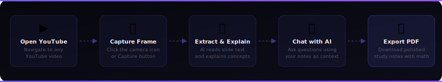
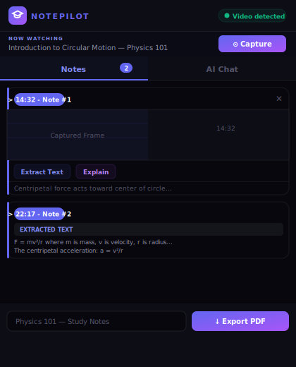
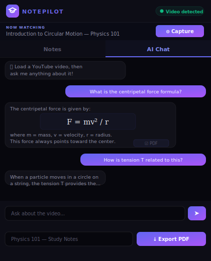
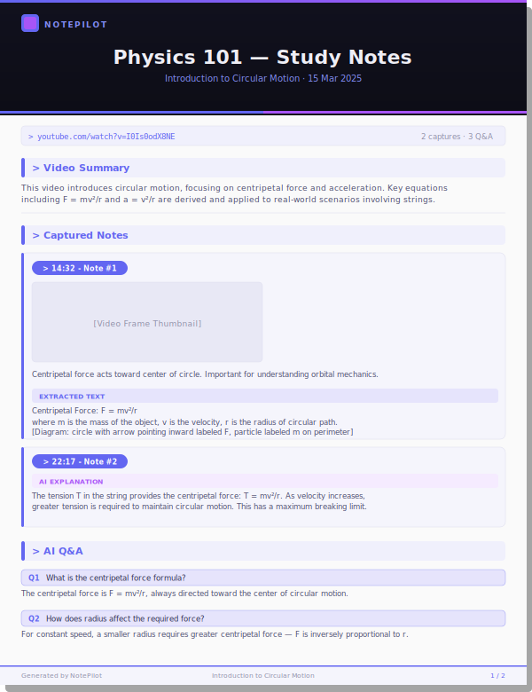

<p align="center">
  
</p>

<p align="center">
  
  
  
  
  
</p>

---

**NotePilot** is a Chrome extension that turns any YouTube video into an interactive study session. Capture frames at any timestamp, let AI extract and explain on-screen content, chat with an AI tutor using your notes as context, and export everything as a polished PDF with fully rendered math equations.

---

## How It Works

<p align="center">
  
</p>

---

## Screenshots

<table>
  <tr>
    <td align="center" width="50%">
      <strong>Notes Panel</strong><br/><br/>
      
      <br/><sub>Capture frames, extract text, and add notes at any timestamp</sub>
    </td>
    <td align="center" width="50%">
      <strong>AI Chat Panel</strong><br/><br/>
      
      <br/><sub>Ask questions — your captures and OCR text are used as context</sub>
    </td>
  </tr>
</table>

<br/>

<p align="center">
  <strong>PDF Export Preview</strong><br/><br/>
  
  <br/><sub>A4 export with cover page, AI summary, capture cards, and Q&amp;A — math renders as images</sub>
</p>

---

## Features

### Frame Capture
- Capture the current video frame from the YouTube player via a toolbar button injected into the YT controls, or from the extension popup.
- Frames are cropped precisely to the video area using the device pixel ratio for sharp results.
- Each capture is saved with its timestamp, a user note, and source video metadata.

### AI Text Extraction (OCR)
- Sends the captured frame to **Llama 4 Scout** (vision model via Groq) to extract all visible text exactly as it appears.
- Handles equations, diagrams, multiple-choice options, and list layouts.
- Diagram descriptions are enclosed in `[square brackets]` for easy identification.
- Raw output only — no solving or summarising.

### AI Explanation
- One-click explanation of any extracted slide content by **Llama 3.3 70B** (Groq).
- Responses use LaTeX notation (`$...$` inline, `$$...$$` display) rendered live with **KaTeX**.

### AI Chat
- Conversational assistant scoped to the current video.
- Automatically includes captured notes and extracted slide text as context.
- Supports multi-turn conversation with the last 4 Q&A pairs for coherent follow-ups.
- Each answer can be individually toggled in/out of the PDF export.

### PDF Export
- Generates a professionally styled A4 PDF via **jsPDF**.
- Cover page with video title, date, capture count, and a clickable YouTube link.
- AI-generated video summary section.
- Each capture presented as a card with: timestamp pill, screenshot thumbnail, user note, extracted text, and AI explanation.
- AI Q&A section at the end with page footers.
- **Math rendering**: LaTeX expressions are rasterised via KaTeX + html2canvas with precise baseline alignment — math never overlaps surrounding text.
- **Font safety**: all text is sanitised before rendering — Greek letters, smart quotes, arrows, and Unicode symbols are mapped to ASCII to prevent jsPDF's silent Courier font fallback.

### Persistence
- All notes, captures, AI responses, and settings stored in `chrome.storage.local`, keyed by video ID.
- Re-opening the popup for the same video restores all previous work automatically.

---

## Tech Stack

| Layer | Technology |
|---|---|
| Extension platform | Chrome Manifest V3 |
| AI — chat & explanations | [Groq](https://groq.com) — Llama 3.3 70B Versatile |
| AI — vision / OCR | [Groq](https://groq.com) — Llama 4 Scout 17B |
| Math rendering (UI) | [KaTeX](https://katex.org) v0.16.9 |
| Math rendering (PDF) | KaTeX + [html2canvas](https://html2canvas.hertzen.com) |
| PDF generation | [jsPDF](https://github.com/parallax/jsPDF) |
| Screenshot | `chrome.tabs.captureVisibleTab` |
| Storage | `chrome.storage.local` |

---

## Project Structure

```
notepilot/
├── manifest.json          # Chrome Manifest V3 config
├── index.html             # Extension popup UI
├── style.css              # Popup styles (dark theme)
├── script.js              # Core logic — capture, AI, PDF export
├── config.js              # API key configuration  ← add to .gitignore
├── background.js          # Service worker — captureVisibleTab
├── content.js             # Injected into YouTube — player button + video info
├── content-inject.css     # Styles for injected YT player elements
├── mathjax-config.js      # MathJax configuration (reserved)
├── katex.min.js           # Bundled KaTeX
├── html2canvas.min.js     # Bundled html2canvas
└── jspdf.min.js           # Bundled jsPDF
```

---

## Installation

### 1. Clone the repository

```bash
git clone https://github.com/your-username/notepilot.git
cd notepilot
```

### 2. Add your Groq API key

Open `config.js` and replace the placeholder:

```js
const NOTEPILOT_CONFIG = {
    GROQ_API_KEY: 'your_groq_api_key_here'
};
```

> Get a free API key at [console.groq.com](https://console.groq.com).
> **Important:** add `config.js` to your `.gitignore` before committing.

### 3. Load in Chrome

1. Open `chrome://extensions`
2. Enable **Developer mode** (toggle, top-right)
3. Click **Load unpacked**
4. Select the `notepilot/` folder

The NotePilot icon will appear in your Chrome toolbar.

---

## Usage

1. **Open a YouTube video** in Chrome.
2. **Click the NotePilot icon** in the toolbar to open the popup — the video is detected automatically.
3. Click **Capture** in the popup, or use the **camera icon** injected into the YouTube player controls.
4. In the **Notes** tab, click **Extract Text** on any capture to run AI OCR, then **Explain** to get an AI explanation.
5. Switch to **AI Chat** to ask questions — your notes and extracted content are included as context automatically.
6. Enter a title in the footer and click **Export PDF** to download your study notes.

---

## Configuration

| Setting | File | Default |
|---|---|---|
| Groq API key | `config.js` | — (required) |
| Chat model | `script.js → MODEL_CHAT` | `llama-3.3-70b-versatile` |
| Vision / OCR model | `script.js → MODEL_VISION` | `meta-llama/llama-4-scout-17b-16e-instruct` |

---

## Permissions

| Permission | Reason |
|---|---|
| `activeTab` | Read the current YouTube tab URL and communicate with the content script |
| `scripting` | Inject the capture button into the YouTube player |
| `storage` | Persist notes and AI responses locally across sessions |
| `tabs.captureVisibleTab` | Take a screenshot of the current tab for frame capture |

---

## Known Limitations

- Only works on `youtube.com/watch` URLs.
- Frame capture requires the YouTube tab to be visible (Chrome restriction on `captureVisibleTab`).
- PDF math rendering is sequential — pages with many equations take longer to generate.
- The Groq free tier has rate limits; heavy usage may require a paid plan.

---

## License

MIT © 2025 NotePilot
