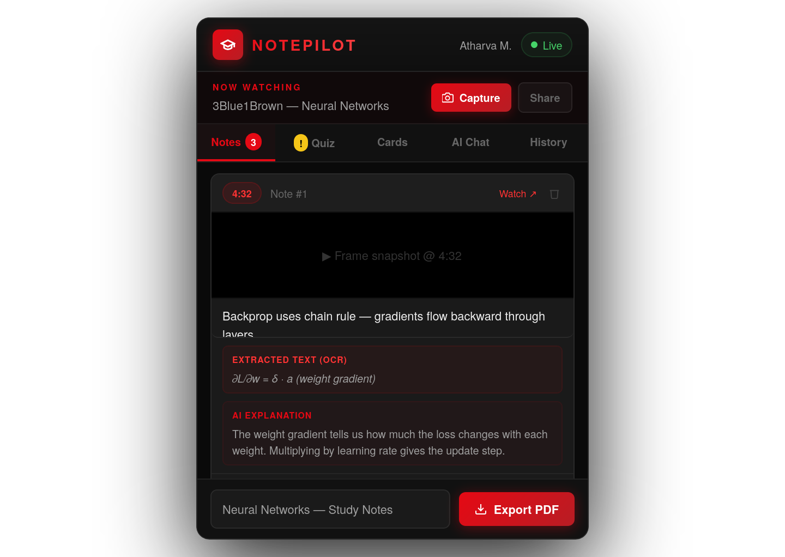
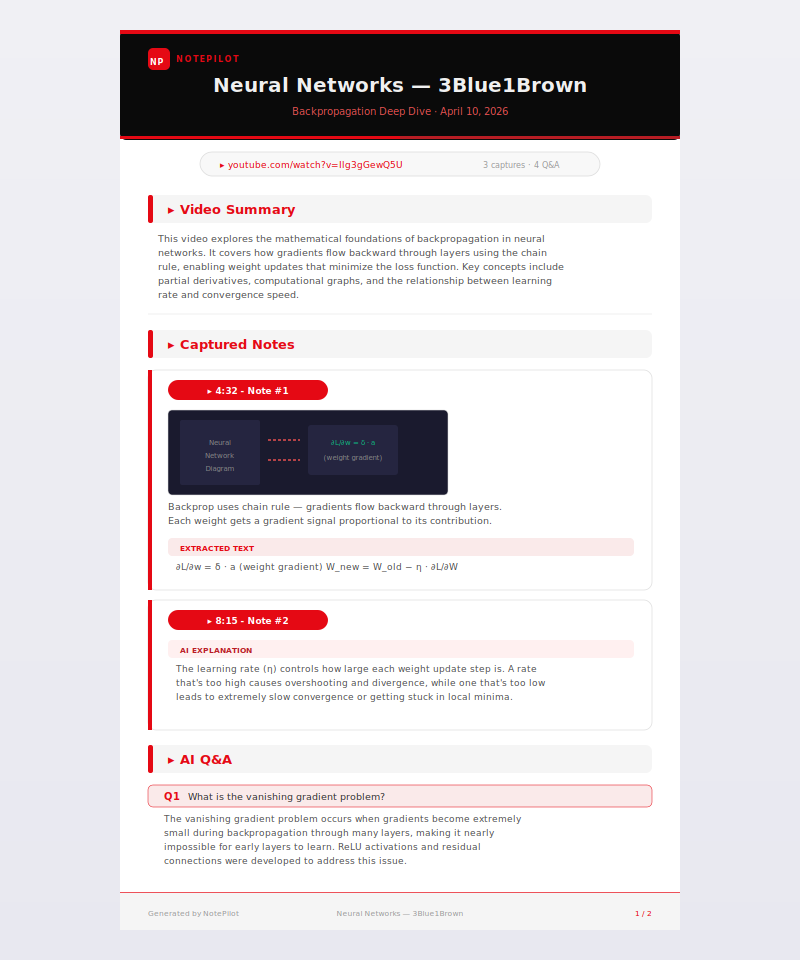
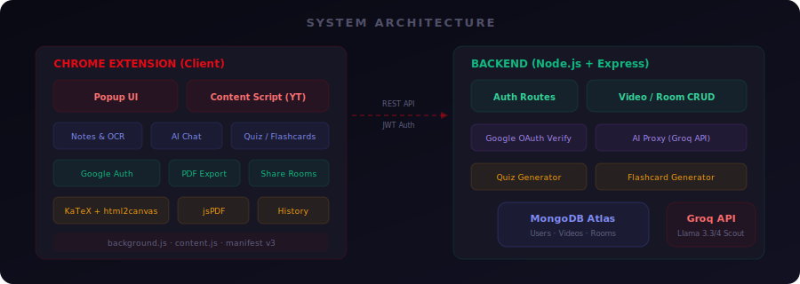
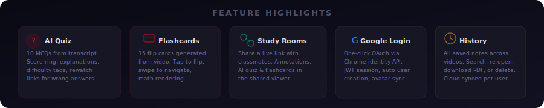

<p align="center">
  
</p>

<p align="center">
  
  
  
  
  
</p>

<p align="center">
  
  
  
  
  
</p>

<p align="center">
  <b>NotePilot</b> is a full-stack Chrome extension that transforms any YouTube video into an<br/>
  interactive AI-powered study session — capture frames, extract text, quiz yourself,<br/>
  practice flashcards, share live study rooms, and export polished PDF notes.
</p>

---

## 📑 Table of Contents

- [How It Works](#-how-it-works)
- [Screenshots](#-screenshots)
- [Architecture](#-architecture)
- [Features](#-features)
- [Tech Stack](#-tech-stack)
- [Project Structure](#-project-structure)
- [Installation](#-installation)
- [Usage](#-usage)
- [API Reference](#-api-reference)
- [Configuration](#-configuration)
- [Deployment](#-deployment)
- [Known Limitations](#-known-limitations)
- [Contributing](#-contributing)
- [License](#-license)

---

## 🔄 How It Works

<p align="center">
  
</p>

| Step | Action | Description |
|:---:|---|---|
| **1** | 🎥 **Watch** | Open any YouTube video — NotePilot auto-detects it |
| **2** | 📸 **Capture** | Grab video frames with one click. AI extracts text & explains slides |
| **3** | 🧠 **Learn** | Use AI Chat, take a 10-question Quiz, or study with Flashcards |
| **4** | 🔗 **Share & Export** | Download a polished PDF or share a live study room link |

---

## 📸 Screenshots

### Notes Panel — Capture, OCR & AI Explain

<p align="center">
  
</p>

> Capture video frames at any timestamp. AI extracts all visible text (OCR) and provides instant explanations. Add your own notes and export everything as a styled PDF.

---

### AI Chat & Quiz Mode

<p align="center">
  
</p>

<table>
  <tr>
    <td width="50%">
      <strong>💬 AI Chat</strong> — Ask questions about the video. Your captured notes and OCR text are automatically included as context for accurate, video-specific answers.
    </td>
    <td width="50%">
      <strong>❓ Quiz Mode</strong> — AI generates MCQs from the video transcript. Features difficulty tags, score tracking, explanations, and rewatch links for wrong answers.
    </td>
  </tr>
</table>

---

### History & Flashcards

<p align="center">
  
</p>

<table>
  <tr>
    <td width="50%">
      <strong>📚 History</strong> — View all saved notes across videos. Search, re-open on YouTube, download PDFs from history, or delete. Cloud-synced per user.
    </td>
    <td width="50%">
      <strong>📇 Flashcards</strong> — AI generates flip-to-reveal study cards from video content. Tap to flip between question and answer, swipe to navigate.
    </td>
  </tr>
</table>

---

### PDF Export

<p align="center">
  
</p>

> Professionally styled A4 PDF with cover page, AI-generated video summary, timestamped capture cards with screenshots, OCR text, AI explanations, Q&A section, and branded footers. Math equations are rendered via KaTeX + html2canvas.

---

## 🏗 Architecture

<p align="center">
  
</p>

NotePilot is a **full-stack application** with two main layers:

| Layer | Description |
|---|---|
| **Chrome Extension** | Manifest V3 popup + content script injected into YouTube. Handles UI, frame capture, PDF generation, and all user interactions. |
| **Backend API** | Node.js + Express server with MongoDB. Manages auth (email/password + Google OAuth), video data persistence, shared rooms, and AI proxy to Groq. |

> 🔐 All AI calls are proxied through the backend — the Groq API key never reaches the client.

---

## ✨ Features

<p align="center">
  
</p>

<details>
<summary><strong>🎥 Frame Capture</strong></summary>

- Capture the current video frame via a toolbar button injected into YouTube player controls, or from the extension popup
- Frames are cropped precisely to the video area using the device pixel ratio for sharp results
- Each capture is saved with its timestamp, a user note, and source video metadata
</details>

<details>
<summary><strong>🔍 AI Text Extraction (OCR)</strong></summary>

- Sends the captured frame to **Llama 4 Scout** (vision model via Groq) to extract all visible text
- Handles equations, diagrams, multiple-choice options, and list layouts
- Diagram descriptions are enclosed in `[square brackets]` for easy identification
- Raw output only — no solving or summarising
</details>

<details>
<summary><strong>✨ AI Explanation</strong></summary>

- One-click explanation of any extracted slide content by **Llama 3.3 70B**
- Responses use LaTeX notation (`$...$` inline, `$$...$$` display) rendered live with **KaTeX**
</details>

<details>
<summary><strong>💬 AI Chat Tutor</strong></summary>

- Conversational assistant scoped to the current video
- Automatically includes captured notes and extracted slide text as context
- Supports multi-turn conversation with the last 4 Q&A pairs for coherent follow-ups
- Each answer can be individually toggled in/out of the PDF export
</details>

<details>
<summary><strong>❓ AI Quiz Mode</strong></summary>

- AI generates **10 MCQs** from the entire video transcript or from your captured notes
- Difficulty tags: easy (3), medium (5), hard (2) questions
- Score ring, explanations, topic tags, and **rewatch links** for wrong answers
- Choose between "Full transcript" or "My notes only" as the quiz source
</details>

<details>
<summary><strong>📇 AI Flashcards</strong></summary>

- Generates **15 flip-to-reveal study cards** from the video transcript or captured notes
- Each card has a topic tag, question (front), and answer (back)
- Tap to flip, swipe to navigate, supports KaTeX math rendering
</details>

<details>
<summary><strong>🔗 Shared Study Rooms</strong></summary>

- Share your notes as a **live collaborative room** with a unique link
- Room viewers can browse captures, add annotations, generate quizzes, and create flashcard sets
- Notes sync automatically — captures made after sharing are pushed in real-time
- Hosted on Vercel or viewable via the extension's built-in viewer
</details>

<details>
<summary><strong>🔐 Authentication</strong></summary>

- **Email + Password** registration and login with bcrypt hashing
- **Google Sign-In** via Chrome's `chrome.identity.launchWebAuthFlow()` API
  - One-click OAuth2 flow → Google consent popup → ID token → JWT session
  - Automatically creates a user account on first Google sign-in
  - Syncs Google profile name and avatar
- JWT tokens stored in `localStorage` and `chrome.storage.local`
</details>

<details>
<summary><strong>📚 History</strong></summary>

- View all saved video notes in a searchable, scrollable list
- Each card shows: video title, note count, Q&A count, shared badge, relative date
- Actions: Open on YouTube, Download PDF (from history), Delete
- Cloud-synced per user — your notes follow you across devices
</details>

<details>
<summary><strong>📄 PDF Export</strong></summary>

- Generates a **professionally styled A4 PDF** via jsPDF
- Cover page with video title, date, capture count, and clickable YouTube link
- AI-generated video summary, capture cards with screenshots, OCR text, explanations
- **Math rendering**: LaTeX → KaTeX → html2canvas with precise baseline alignment
- **Font safety**: Unicode symbols mapped to ASCII to prevent font fallback issues
</details>

---

## 🛠 Tech Stack

| Layer | Technology |
|---|---|
| Extension Platform | Chrome Manifest V3 |
| Backend Framework | [Express.js](https://expressjs.com) (Node.js) |
| Database | [MongoDB Atlas](https://www.mongodb.com/atlas) via Mongoose |
| Authentication | JWT + Google OAuth 2.0 + bcryptjs |
| AI — Chat & Explanations | [Groq](https://groq.com) — Llama 3.3 70B Versatile |
| AI — Vision / OCR | [Groq](https://groq.com) — Llama 4 Scout 17B |
| AI — Quiz & Flashcards | [Groq](https://groq.com) — Llama 3.3 70B (structured JSON) |
| Math Rendering (UI) | [KaTeX](https://katex.org) v0.16.9 |
| Math Rendering (PDF) | KaTeX + [html2canvas](https://html2canvas.hertzen.com) |
| PDF Generation | [jsPDF](https://github.com/parallax/jsPDF) |
| Screenshot | `chrome.tabs.captureVisibleTab` |
| Google Auth (Extension) | `chrome.identity.launchWebAuthFlow` |
| Google Auth (Backend) | [google-auth-library](https://github.com/googleapis/google-auth-library-nodejs) |
| Room Viewer Hosting | [Vercel](https://vercel.com) |
| Backend Hosting | [Render](https://render.com) |

---

## 📁 Project Structure

```
NotePilot/
├── manifest.json              # Chrome Manifest V3 config
├── index.html                 # Extension popup UI
├── style.css                  # Popup styles (dark theme)
├── script.js                  # Core logic — capture, AI, PDF, quiz, flashcards, share, history
├── config.js                  # Client config: backend URL, Google Client ID
├── background.js              # Service worker — captureVisibleTab
├── content.js                 # Injected into YouTube — player button + transcript
├── content-inject.css         # Styles for injected YouTube elements
├── katex.min.js               # Bundled KaTeX
├── html2canvas.min.js         # Bundled html2canvas
├── jspdf.min.js               # Bundled jsPDF
│
├── room/
│   └── index.html             # Shared room viewer (self-contained SPA)
│
├── images/                    # README assets (SVG diagrams)
│   ├── hero.svg
│   ├── workflow.svg
│   ├── architecture.svg
│   ├── features.svg
│   └── ...
│
├── ss/                        # Real extension screenshots
│   ├── image.png              # Notes panel
│   ├── image copy.png         # AI Chat + Quiz
│   ├── image copy 2.png       # History + Flashcards
│   └── image copy 3.png       # Architecture overview
│
└── backend/
    ├── server.js              # Express API server
    ├── package.json           # Backend dependencies
    ├── .env                   # Environment variables (secrets)
    ├── .env.example           # Template for .env
    └── models/
        ├── User.js            # User schema (email, googleId, avatar)
        ├── Video.js           # Per-user video data (notes, QA, settings)
        └── Room.js            # Shared room schema (notes, annotations)
```

---

## 🚀 Installation

### 1. Backend Setup

```bash
# Clone the repository
git clone https://github.com/AtharvaMate/NotePilot.git
cd NotePilot/backend

# Install dependencies
npm install

# Configure environment
cp .env.example .env
# Edit .env with your values (see Environment Variables below)

# Start the server
npm run dev
```

> **Note**: The backend is already deployed at `https://notepilot-3ntc.onrender.com`. You only need to run locally for development.

### 2. Google OAuth Setup

To enable **Sign in with Google**:

1. Go to [Google Cloud Console → Credentials](https://console.cloud.google.com/apis/credentials)
2. Create a new **OAuth 2.0 Client ID** (type: **Web application**)
3. Under **Authorized redirect URIs**, add:
   ```
   https://<YOUR_EXTENSION_ID>.chromiumapp.org/
   ```
   > 💡 Find your extension ID at `chrome://extensions` with Developer Mode on
4. Copy the **Client ID** and set it in:
   - `config.js` → `GOOGLE_CLIENT_ID`
   - `backend/.env` → `GOOGLE_CLIENT_ID`
5. Configure the [OAuth consent screen](https://console.cloud.google.com/apis/credentials/consent) (Testing or Published)

### 3. Chrome Extension Setup

1. Open `chrome://extensions`
2. Enable **Developer mode** (top-right toggle)
3. Click **Load unpacked** → select the `NotePilot/` root folder
4. The NotePilot icon appears in your toolbar ✅

### Environment Variables

Create `backend/.env`:

```env
PORT=3001
MONGODB_URI=mongodb+srv://<user>:<pass>@<cluster>.mongodb.net/notepilot
GROQ_API_KEY=gsk_your_groq_api_key_here
JWT_SECRET=your-secret-key-min-32-chars
GOOGLE_CLIENT_ID=your-google-client-id.apps.googleusercontent.com
```

| Variable | Description | Required |
|---|---|---|
| `PORT` | Server port | No (default: 3001) |
| `MONGODB_URI` | MongoDB connection string | ✅ |
| `GROQ_API_KEY` | [Groq](https://console.groq.com) API key for AI features | ✅ |
| `JWT_SECRET` | Secret for signing JWT auth tokens | ✅ |
| `GOOGLE_CLIENT_ID` | Google OAuth Client ID | ✅ |

---

## 📖 Usage

| Step | Action |
|:---:|---|
| 1 | **Sign in** — Click NotePilot icon → sign in with email or Google |
| 2 | **Open a YouTube video** — auto-detected |
| 3 | **Capture** — Click `Capture` in popup or camera icon in YouTube player |
| 4 | **Extract & Explain** — Click `Extract Text` for OCR, then `Explain` |
| 5 | **AI Chat** — Switch to Chat tab, ask questions about the video |
| 6 | **Quiz** — Go to Quiz tab → choose source → `Generate Quiz` |
| 7 | **Flashcards** — Go to Cards tab → `Generate Flashcards from Notes` |
| 8 | **Share** — Click `Share` to create a live study room link |
| 9 | **Export** — Enter a title → `Export PDF` |
| 10 | **History** — Go to History tab to revisit any saved video |

---

## 📡 API Reference

<details>
<summary><strong>Authentication</strong></summary>

| Method | Endpoint | Auth | Description |
|---|---|:---:|---|
| `POST` | `/api/auth/register` | ✗ | Register with email + password |
| `POST` | `/api/auth/login` | ✗ | Login with email + password |
| `POST` | `/api/auth/google` | ✗ | Verify Google ID token, create/login user |
| `GET` | `/api/auth/me` | ✓ | Get current user profile |
</details>

<details>
<summary><strong>Video Data</strong></summary>

| Method | Endpoint | Auth | Description |
|---|---|:---:|---|
| `GET` | `/api/videos` | ✓ | List all saved videos (lightweight) |
| `GET` | `/api/videos/:videoId` | ✓ | Get full video data |
| `PUT` | `/api/videos/:videoId` | ✓ | Save / update video data |
| `DELETE` | `/api/videos/:videoId` | ✓ | Delete saved video data |
</details>

<details>
<summary><strong>Shared Rooms</strong></summary>

| Method | Endpoint | Auth | Description |
|---|---|:---:|---|
| `POST` | `/api/rooms` | ✓ | Create a new room |
| `GET` | `/api/rooms/:roomId` | ✗ | Get room data (public) |
| `PATCH` | `/api/rooms/:roomId` | ✓ | Update room notes |
| `PUT` | `/api/rooms/:roomId/notes/:idx` | ✓ | Push a single note (live sync) |
| `PATCH` | `/api/rooms/:roomId/notes/:idx` | ✓ | Update note text fields |
| `POST` | `/api/rooms/:roomId/annotations` | ✗ | Add annotation |
| `GET` | `/api/rooms/:roomId/annotations` | ✗ | Get annotations |
</details>

<details>
<summary><strong>AI Proxy</strong></summary>

| Method | Endpoint | Auth | Description |
|---|---|:---:|---|
| `POST` | `/api/ai/chat` | ✓ | Chat completion (Llama 3.3 70B) |
| `POST` | `/api/ai/vision` | ✓ | Vision completion (Llama 4 Scout) |
| `POST` | `/api/ai/quiz` | ✗ | Generate 10-question quiz (JSON) |
| `POST` | `/api/ai/flashcards` | ✗ | Generate 15 flashcards (JSON) |
</details>

<details>
<summary><strong>Room Quizzes & Flashcards</strong></summary>

| Method | Endpoint | Auth | Description |
|---|---|:---:|---|
| `POST` | `/api/rooms/:roomId/quiz` | ✗ | Save quiz to room |
| `GET` | `/api/rooms/:roomId/quizzes` | ✗ | List room quizzes |
| `GET` | `/api/rooms/:roomId/quiz/:quizId` | ✗ | Get specific quiz |
| `POST` | `/api/rooms/:roomId/flashcards` | ✗ | Save flashcard set |
| `GET` | `/api/rooms/:roomId/flashcards` | ✗ | List flashcard sets |
| `GET` | `/api/rooms/:roomId/flashcards/:setId` | ✗ | Get specific set |
</details>

---

## ⚙️ Configuration

| Setting | File | Default |
|---|---|---|
| Backend URL | `config.js` | `https://notepilot-3ntc.onrender.com` |
| Room Viewer URL | `config.js` | `https://notepilot-room.vercel.app` |
| Google Client ID | `config.js` + `.env` | — (required) |
| Chat Model | `backend/server.js` | `llama-3.3-70b-versatile` |
| Vision Model | `backend/server.js` | `meta-llama/llama-4-scout-17b-16e-instruct` |

### Permissions

| Permission | Reason |
|---|---|
| `activeTab` | Read the current YouTube tab URL |
| `scripting` | Inject capture button into YouTube player |
| `storage` | Persist auth tokens and sync state |
| `identity` | Google Sign-In via `chrome.identity.launchWebAuthFlow()` |

---

## 🌐 Deployment

### Backend → Render

1. Push to GitHub
2. Create a **Web Service** on [Render](https://render.com)
3. Set root directory: `backend`, build: `npm install`, start: `npm start`
4. Add all environment variables

### Room Viewer → Vercel

1. Deploy `room/index.html` as a static site on [Vercel](https://vercel.com)
2. Update `config.js → ROOM_VIEWER_URL`

### Extension → Chrome Web Store

1. Zip the project (exclude `backend/`, `node_modules/`, `.env`)
2. Upload at [Chrome Developer Dashboard](https://chrome.google.com/webstore/devconsole)

---

## 🤝 Contributing

Contributions are welcome! Please:

1. Fork the repository
2. Create a feature branch (`git checkout -b feature/amazing-feature`)
3. Commit your changes (`git commit -m 'Add amazing feature'`)
4. Push to the branch (`git push origin feature/amazing-feature`)
5. Open a Pull Request

---

## 📄 License

MIT © 2025 NotePilot